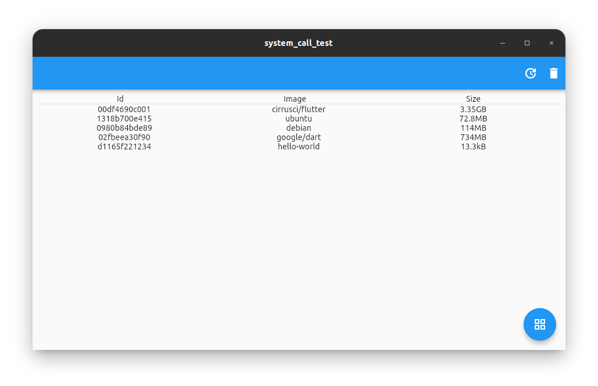

 

# DockRay
A docker manager with soft use.

# Powered by *Flutter* 💙
Flutter enables cross-platform code, which helps achieve more users and write less code.
Seems perfect, right? It mighty be.

## Docker
Install docker and congfigure non-sudo execution for docker CLI.

## How does it work ?
DockRay calls docker CLI to get container's info and run actions.

Until there is a stable/official cross-platform docker lib to use, it shall be how it works. 

## TODO:
<image src="README/work_in_progress.jpg" width= 200>

- [x] List available containers
- [x] Prune docker system
- [x] Add yaru theme for linux
- [ ] Update loading screen (**DOING**)
- [ ] Add grid layoyt
- [ ] Add running containers viw
- [ ] Add language translation support
 
